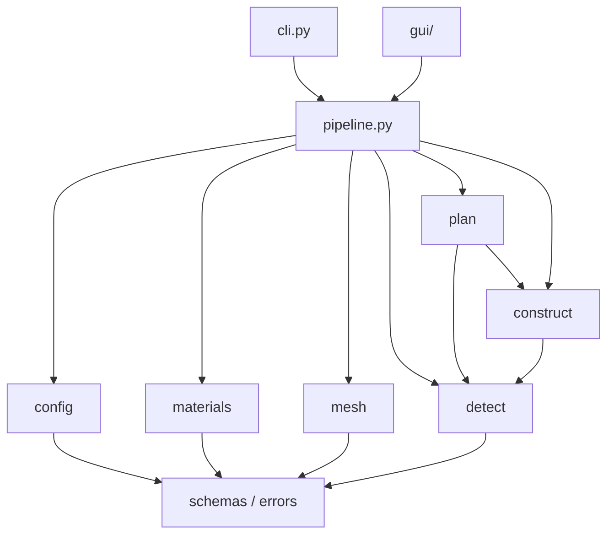

# spruegen architecture

This document records where the code stood at v0.2.0, what v0.3.0 changes, and the roadmap from here. Engine messages are still in Spanish (that is the shop's language); the docs are in English so outside contributors can follow them.

## What spruegen does

It takes the STL of **one ring** and produces a printable sprue tree for lost-wax casting:

- feeders attach **only to the inner face** of the shank, so lattice, filigree and engraving on the outside stay untouched (verified to 0.05 mm);
- a Ø10 × 35 mm downstem (editable) that fits the shop's rubber sprue base, or a short stub instead (`stem_kind: "stub"`); the stub is planned as a small stem, so routing and validation are shared;
- the number and placement of feeders come from a geometric feeding analysis (thermal modulus plus directional-solidification paths), not from a CFD simulation;
- the result is one watertight, validated mesh.

The workflow is `inspect → analyze → propose → (human review) → apply → validate`. `propose` never writes `out.stl`; only `apply` does, and only after validation passes.

---

## 1. Current state as found (v0.2.0)

### Layout

Everything lived flat in one package: 18 modules, about 5.8k lines of Python plus a 670-line web GUI.

```
spruegen/
  cli.py        596  typer CLI + ALL pipeline orchestration (run_propose, run_apply, …)
  schemas.py    312  pydantic models: Profile, Job, Proposal, Features, … + exceptions + loaders
  io.py / repair.py / union.py         mesh I/O, repair, manifold union
  features.py   451  finger axis (PCA + circle fit + tunnel test), radial ray scan, head detection
  voxel.py      163  slice voxeliser, EDT thermal modulus, cell graph, widest-path/geodesics
  analysis.py   302  feeding analysis: greedy set cover, capacity, symmetry, isolated zones, last-to-fill
  policy.py     103  locks, overrides, feeder sizing
  tree.py       558  routing: single / spider / Y, alternates, placement checks
  vents.py      100  vent rods where metal arrives last
  build.py      133  meshes for stem, feeders, fillets, hub, vents; preview export
  validate.py   265  watertight, one body, stem size, hole clearance, outer-face diff, locks
  presets.py + presets/*.json          metal/process presets
  render.py / showcase.py / castlog.py matplotlib renders, demo gallery, casting log
  gui/          FastAPI server + service + regex i18n + three.js front end
```

### Strengths worth keeping

- **Deterministic and conservative.** Nothing attaches to the outer face, locks keep the chosen stem from changing behind your back (a `job.json` override can't touch it), `apply` validates the reloaded float32 STL, and it writes atomically.
- **The algorithms are sound.** The EDT thermal modulus is a proxy for Chvorinov's rule, the maximin path over a maximum spanning tree models directional solidification, and greedy set cover followed by reverse delete picks the feeders.
- **Good tests for a geometry tool.** There are 55 tests, including parametric rings (signet, solitaire, lattice, dumbbell) and an end-to-end GUI flow.
- **The file contract is clear.** `profile.json`, `job.json`, `proposal.json`, `preview_*.stl` and `out.stl` each have a single writer.

### Problems

| # | Problem | Why it matters |
|---|---|---|
| 1 | **Orchestration lived in `cli.py`.** The GUI and the showcase imported `cli` to reach `run_propose` / `run_apply`. | Business logic was coupled to typer. Any new front end (desktop app, API, plugin) had to import a CLI module. |
| 2 | **Flat package with no layering.** `analysis` imported `tree`, `tree` imported `build`, and `validate` imported `features` and `policy`. | It was hard to see what depended on what, or to test a stage on its own. |
| 3 | **Metallurgy was just a string.** `Profile.metal = "Ag925"` was a label. No density, melting range, pour or flask temperatures, or shrinkage existed anywhere. The "physics" parameters (`feed_reach_mm`, `feeder_capacity_mm3`) were uncited guesses repeated in every preset. | There was no source of truth and no way to show a jeweller *why* a number is what it is. |
| 4 | **Presets were copy-pasted.** Six JSON files each repeated all ~18 shop keys to change two or three. | Changing one shop rule meant editing six files. |
| 5 | **The GUI translated engine messages with regular expressions.** The engine speaks Spanish; `gui/i18n.py` pattern-matched each sentence into English. | Rewording a Spanish message silently broke the translation, and any new message came out untranslated. |
| 6 | **Exceptions were defined in `schemas.py`.** | Every module imported the data-model file just to raise an error. |
| 7 | **No open-source scaffolding.** No LICENSE, no CONTRIBUTING, no CI, no git history. 90 MB of generated showcase and workdir output sat next to the source. | It couldn't be published as it stood. |

---

## 2. What v0.3.0 changes

### New layout

The code is now layered, and imports only point downward:

```
spruegen/
  errors.py            exception hierarchy (schemas re-exports it for compatibility)
  schemas.py           data contracts: Profile (+ alloy id), Job, Proposal (+ casting sheet), …
  pipeline.py          ★ orchestration: run_inspect/analyze/propose/apply/validate/batch. No typer, no fastapi.
  cli.py               thin typer layer over pipeline (+ `materials` subcommands)
  gui/                 FastAPI layer over pipeline (unchanged API, + `casting` in /generate)

  mesh/     io, repair, union             STL I/O, repair, manifold union
  detect/   features, voxel               understand the ring (axis, faces, thickness, modulus field)
  plan/     analysis, policy, tree, vents decide the tree
  construct/ sprues, validate             build meshes, validate the union
  config/   presets (+ presets/*.json)    profile resolution with `extends` inheritance
  materials/ db, casting, data/alloys.json ★ cited alloy database (single source of truth)
  report/   render, showcase, castlog     images, gallery, casting log
```



The module moves are mechanical: file contents are unchanged apart from import lines. Inside modules, the old names are kept as aliases (for example `from spruegen.construct import sprues as build`), so call sites and diffs stay small. `spruegen.cli` still re-exports `run_*` for scripts written against 0.2.

### Materials database: the single source of truth

`spruegen/materials/data/alloys.json` holds 23 alloys, 52 sources and 27 sprueing rules. **Every number carries a citation**: a `source` id into the bibliography plus a `locator` (table, page or quote). Derived values say `"source": "derived"` and include the `method`. The file keeps conflicting published values in `alt[]` rather than silently choosing one. Two tests enforce this: `test_every_number_is_cited` and `test_derived_values_explain_method`. See [MATERIALS.md](MATERIALS.md).

- `materials.db` is a typed read API: `load()`, `get(id)`, `pour_c(section)`, `flask_c(section)`, `check()`, and a bibliography lookup.
- `materials.casting.sheet()` is advisory and deterministic, and never changes geometry. For every proposal it reports:
  - metal mass for the ring, the tree and the total;
  - pour and flask windows for the ring's section class (thin / medium / heavy, using Legor's < 0.5 and ≤ 1.2 mm splits);
  - the investment type;
  - rule checks: feeder Ø against the section it feeds, whether the alloy needs phosphate investment, and pour temperatures above the gypsum-breakdown limit;
  - the list of sources it used.
- `Profile.alloy` links a preset to the database. Presets are now diffs, for example `{"extends": "au14k", "metal": "Au18k", "alloy": "au18y"}`.
- There are new presets: `pt950` (Pt-Ru, phosphate investment) and `au18k_white_pd`.
- CLI: `spruegen materials list | show ID [--section thin] | rules | check [file.json]`.

### Deliberately unchanged in this pass

- **Geometry and routing.** `detect`, `plan` and `construct` have identical logic. The refactor preserves behaviour; the casting sheet only adds warnings.
- **Feeding parameters** (`feed_reach_mm`, `feeder_capacity_mm3`, `neck_ratio`) are still shop-calibrated starting values. The literature has **no published Chvorinov mould constant for gypsum investment** (Heiss 2015), so these cannot be derived from the database yet. They are labelled as uncited on purpose.
- **Engine language.** Messages stay in Spanish, and the regex i18n still runs. The new casting warnings already carry a stable `code` + `params` alongside the text. That is the pattern the rest of the engine should move to (see the roadmap).

---

## 3. Roadmap

### Phase A: architecture (remaining)

1. **Structured diagnostics.** Replace free-text warnings with `Diagnostic(code, severity, params)` everywhere, as the casting sheet already does, with message catalogs `es.json` and `en.json`. Then delete the regex i18n. This is the one change that makes a multilingual GUI safe.
2. **Split `pipeline.run_propose`**, currently about 150 lines, into `plan_tree()` (pure: returns a Route plus diagnostics) and `write_proposal()` (I/O). The GUI can then preview without touching disk.
3. **Type the `Proposal.analysis` and `Proposal.casting` dicts** as pydantic models, and bump to `schema_version: 3` with an upgrader, in the same style as the v1→v2 upgrader.
4. Replace the module aliases (`sprues as build`) with direct names once the Mac test run confirms the move.

### Phase B: metallurgy

1. **Replace modulus rules of thumb with cited ratios.** The literature gives:
   - feeder modulus ≥ 1.12 × section modulus (feeder freezes 25 % later, n = 2);
   - feeder Ø ≥ 1.0–1.25 × section thickness (Stuller; Hoover & Strong);
   - ingate area 0.7–1.5 × the section area (Bell, Progold).
   Expose these as `rules`-driven checks, and later as sizing inputs behind a flag, so default geometry doesn't change underneath existing users.
2. **Superheat from the database.** Choose the pour temperature from liquidus + superheat by piece size (Umicore) and by method (Stuller: vacuum vs centrifugal), and show it in the GUI.
3. **Fill the gaps.** Thermal conductivity and specific heat for Au, Pt and Pd alloys are missing. Two papers still need reading by hand: Fischer-Bühner, Santa Fe 2007 (sprueing and simulation), and "Optimal gating system design for investment casting of sterling silver" (Int J Adv Manuf Tech, 10.1007/s00170-012-4523-3).
4. **Calibration loop.** `spruegen log` already records outcomes. Store alloy ids in the log, and add `spruegen log fit` to suggest per-alloy `feed_reach_mm` and `feeder_capacity_mm3` from the good and bad casts.
5. Settle the **sprue-angle conflict**: 45° (Stuller, centrifugal/gravity) versus 80–90° (Hoover & Strong vacuum, Progold, Pt simulation). Make it a process-level setting.

### Phase C: UI/UX

- Material picker driven by the database (family → alloy), with a casting-sheet panel showing temperatures, grams of metal and citations on hover.
- Warnings grouped by severity, with "why" links to the rule or source.
- Before/after comparison and an explicit "approve" step that mirrors `propose → apply`.
- Accessibility pass (keyboard, contrast) and an English/Spanish toggle, which depends on Phase A item 1.

### Phase D: open source

- LICENSE (MIT for code, CC BY 4.0 for the data), CONTRIBUTING, CI, and a data-contribution PR template. Done in v0.3.0; relicensed to MIT / CC BY in v0.4.0.
- Publish to GitHub. Keep generated showcase output out of git and publish the gallery via GitHub Pages instead.
- Release wheels (pure Python). Document that `manifold3d` and `shapely` are binary dependencies.
