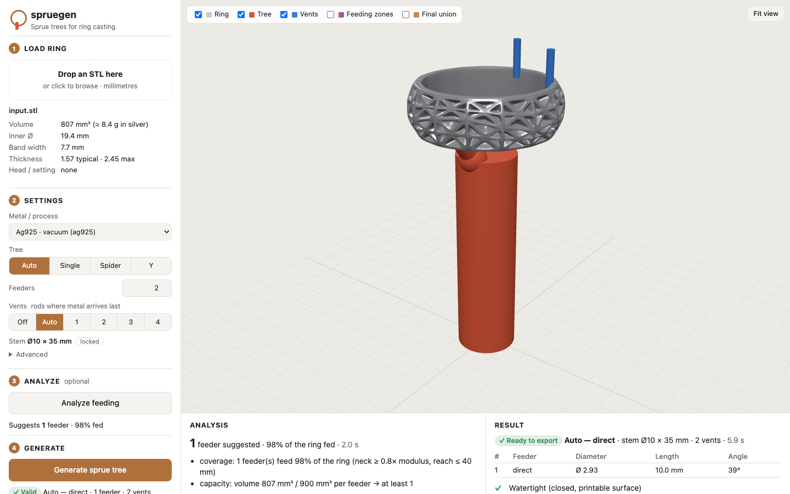

# spruegen

> Versión en español (v0.2). La documentación principal está en [README.md](../README.md); la arquitectura en [ARCHITECTURE.md](ARCHITECTURE.md).

CLI determinista que toma el STL de **un anillo** y genera su **árbol de colada** para lost-wax / resina casteable:

- **feeders solo por la cara interna** del aro: la cara exterior (lattice, filigrana, grabado) queda intacta, verificado al 0.05 mm;
- **downstem** Ø **10 mm** × **35 mm** (base en z=0), bloqueado por default;
- **cuántos feeders y dónde** lo decide un análisis de alimentación (espesor / módulo térmico, cuellos, alcance, capacidad), o lo fijas tú;
- **forma de árbol**: directo, *spider* (varios feeders iguales) o *Y* (tronco que se bifurca);
- **varillas de rebalse/venteo** opcionales donde el metal llega último;
- todo unido, watertight (verificado tras exportar a STL), en mm.

Sin GUI, sin LLM en runtime, sin CFD, sin packing (un anillo por árbol), sin soportes de impresión.


## La forma más fácil: la app (`spruegen gui`)

```bash
cd spruegen
.venv/bin/pip install -e ".[gui]"     # una sola vez
.venv/bin/spruegen gui                # abre http://127.0.0.1:8765 en el navegador
```



App local en el navegador (en inglés; nada sale de tu computadora):

1. **Load ring**: arrastra el STL. Se ve en 3D con volumen, Ø interno, ancho y espesores.
2. **Settings**: metal/proceso, árbol (Auto / Single / Spider / Y), cantidad de feeders, varillas (Off / Auto / 1–4). *Advanced*: espesor mínimo, Ø de feeder, alcance, volumen por feeder. El stem queda bloqueado en Ø10 × 35.
3. **Analyze** (opcional): cuántos feeders sugiere y por qué, mapa del anillo "desenrollado" y zonas de alimentación en 3D.
4. **Generate**: arma el árbol, lo une y lo valida; capas de colores (anillo, árbol, varillas, unión final) y una lista de chequeos ✓/✗.
5. **Export**: `<anillo>_sprued.stl` (el archivo para imprimir) o un paquete `.zip` con previews, render y reporte. Solo se habilita si todo pasó y no cambiaste los ajustes después de generar.

Opciones: `spruegen gui --port 9000 --no-browser`. Ctrl+C para cerrar (borra los archivos temporales de la sesión).

## Instalación

```bash
cd spruegen
python3 -m venv .venv                     # Python 3.11+ (o: uv venv --python 3.12 .venv)
.venv/bin/pip install -e ".[dev,render]"  # render = matplotlib (imágenes, galería)
.venv/bin/pytest                          # tests (incluye GUI y la galería completa)
```

## En 30 segundos

```bash
spruegen demo -o showcase --ring mi_anillo.stl   # anillos de ejemplo + el tuyo -> showcase/index.html
```

## Flujo de trabajo

```bash
spruegen analyze  RING.stl -o analisis/          # ¿cuántos feeders y dónde? mapa + zonas + dónde llega último
spruegen propose  RING.stl -p ag925 -o workdir/  # plan: proposal.json + previews (NUNCA escribe out.stl)
spruegen render   workdir/proposal.json          # render.png + card.html para revisar/compartir
spruegen apply    workdir/proposal.json -o out.stl   # unión + validación; escribe out.stl solo si todo pasa
spruegen validate out.stl --proposal workdir/proposal.json
```

Exit codes: `propose`/`analyze` → 2 si features/policy fallan (mensaje accionable: "posible STL en pulgadas", "no hay attach interno ≥ 1.6 mm", …); `apply`/`validate` → 1 si la validación falla.

### Opciones del árbol

```bash
spruegen propose RING.stl --tree auto                   # default: el análisis decide
spruegen propose RING.stl --tree single                 # un feeder (comportamiento v0.1)
spruegen propose RING.stl --tree spider --feeders 3     # 3 feeders iguales repartidos
spruegen propose RING.stl --tree y --feeders 2          # 2 brazos que comparten un tronco
spruegen propose RING.stl --vents auto                  # varillas donde el metal llega último
spruegen propose RING.stl --vents 2                     # 2 varillas en los huecos entre feeders
```

| Comando | Qué hace |
|---|---|
| `inspect RING.stl` | eje del dedo, radios, espesores, candidatos de attach (JSON) |
| `analyze RING.stl -o dir` | `analysis.json`, `analysis.png` (mapa desenrollado), `zone_feederN.stl` / `zone_isolated.stl` para colorear en el slicer |
| `propose` | `proposal.json`, `preview_ring.stl`, `preview_sprues.stl`, `preview_vents.stl` |
| `apply` | `out.stl` (vía archivo temporal; nunca queda a medias) |
| `validate` | chequeos de abajo |
| `render proposal.json\|OUT.stl` | `render.png` (anillo gris, árbol rojo, varillas azul) + `card.html` |
| `batch CARPETA [--apply]` | un job por STL, `summary.csv` |
| `demo [--ring X.stl]` | galería de ejemplos: `showcase/index.html` + `README.md` |
| `profile list \| show NAME \| new NAME --from ag925` | presets de metal / proceso |
| `log add proposal.json --result good\|porosity\|misrun\|cold_shut\|shrinkage` / `log summary` | bitácora de coladas para calibrar |

### Mirar los previews en el slicer

`preview_ring.stl`, `preview_sprues.stl` y `preview_vents.stl` comparten coordenadas: impórtalos juntos **sin** que el slicer los re-centre (PrusaSlicer: "¿cargar como objeto de varias partes?" → sí; Chitubox/Lychee: selecciónalos y muévelos juntos). Cada uno en su color. `zone_*.stl` de `analyze` hace lo mismo con las zonas que alimenta cada feeder.

## Layout (frame de salida, mm, Z arriba)

```
          ║   ║           varillas (opcionales): canto lejano, por dentro
      ┌───╨───╨───┐
      │  anillo    │      acostado: el hueco del dedo mira al stem
      │ ╲       ╱  │
         ╲     ╱         feeders: salen de la CARA INTERNA y bajan por la boca del hueco
          ╲ Y ╱          (spider: cada uno directo al stem; Y: se juntan en un tronco)
            ●            nudo(s) en la tapa del stem (z = 35)
         ┌──┴──┐
         │     │  stem Ø10 × 35, base en z = 0
         └─────┘
```

Al colar el cilindro se invierte: el metal entra por el stem, recorre el anillo y termina en las varillas.

## Cómo decide (algoritmos)

**1. Eje y caras.** Eje del dedo por PCA + círculo best-fit, verificado como túnel. Abanico de rayos desde el eje: 1er hit = cara interna, 2º = cara externa, diferencia = espesor local.

**2. Dónde se *puede* pegar.** Espesor ≥ `min_attach_thickness_mm`, parche sólido en toda la huella del feeder (veto de lattice/puentes), y la huella completa del feeder deja ≥ 0.3 mm de piel en la cara externa (rayos contra el exterior real). Feeder y filete se recortan con un cilindro coaxial `r_interno + 0.4–0.8 mm`: la penetración nunca depende del ángulo.

**3. Dónde se *debe* pegar (`analyze`, modo `auto`).**
- *Módulo térmico* (Chvorinov): el anillo se voxeliza por slices (0.12–0.25 mm, volumen exacto) y la transformada de distancia da el módulo ≈ medio espesor. Lo claro en el mapa = hot spot, solidifica último.
- *Solidificación direccional*: una zona está alimentada por un feeder si el camino por el metal nunca se angosta por debajo de `neck_ratio` × su módulo (camino *maximin* sobre un árbol generador máximo) y mide ≤ `feed_reach_mm`.
- *Set cover greedy*: se agregan feeders (primero fuera de la cabeza/setting) mientras cada uno alimente ≥ `min_gain_frac` más; luego *reverse delete* quita los que sobran.
- *Capacidad*: mínimo `ceil(volumen / feeder_capacity_mm3)` feeders.
- *Simetría*: con k feeders prueba repartos parejos y los prefiere si cubren casi lo mismo.
- *Cabezas*: detectadas por espesor o por silueta (garras). Un setting fino se alimenta por el shank (feeder lejos de la cabeza); una cabeza maciza (sello) es un hot spot aislado y recibe su propio feeder, por dentro, bajo la cabeza.
- *Zonas aisladas*: lo que nadie alimenta se reporta ("zona aislada … engrosa el puente o agrega feeder").
- *Llega último*: distancia geodésica máxima desde los feeders → lugar de las varillas (`--vents auto`).

**4. Ruteo del árbol.** Directo/spider: cada feeder resuelve su nudo sobre la tapa del stem respetando largo `feeder_len_mm` y ángulo `feeder_angle_deg` (desde el eje del stem); diámetro uniforme = el del attach más delgado. Y: brazos a `arm_angle_deg` hacia un punto de bifurcación bajo el anillo; tronco con área ≥ suma de los brazos (ratio de gating), limitado por `trunk_d_max_mm`. Si un attach no pasa un chequeo, se prueba el siguiente candidato cercano; si no hay, se descarta con aviso (nunca se pega por fuera).

> Los parámetros de alimentación son **valores de partida**, no una simulación. Calíbralos con tus coladas: `spruegen log add … --result porosity` y `spruegen log summary`.

## Presets

```bash
spruegen profile list
spruegen profile new mi_taller --from au14k    # -> profiles/mi_taller.json (se usa con -p mi_taller)
```

| preset | notas |
|---|---|
| `ag925` | plata 925 al vacío (default, números del taller original) |
| `ag925_centrifugal` | centrífuga: más alcance y capacidad por feeder |
| `au14k`, `au18k` | oro: feeder mínimo 2.2 mm, attach mínimo 1.5 mm |
| `bronze`, `brass` | menos fluidos: feeders más gruesos (2.8–4.0), más feeders, varillas `auto` |

Claves del profile (todas opcionales salvo las del taller): las de v0.1 (`stem_d_mm`, `stem_h_mm`, `ring_space_mm`, `feeder_len_mm`, `feeder_angle_deg`, `feeder_d_*`, `attach_mode`, `keepout`, `join_fillet_r_mm`, `boolean_overlap_mm`, `min_attach_thickness_mm`, `lock`, tolerancias) más:

```json
"tree":  {"mode": "auto", "feeders": null, "max_feeders": 4, "neck_ratio": 0.8, "feed_reach_mm": 40,
          "feeder_capacity_mm3": 900, "min_gain_frac": 0.05, "prefer_symmetry": true, "angle_tolerance_deg": 20,
          "uniform": true, "y_merge_deg": 90, "arm_angle_deg": 45, "trunk_d_max_mm": 4.5, "hub": "none"},
"vents": {"mode": "off", "count": 2, "d_mm": 1.2, "len_mm": 5.0, "min_sep_deg": 60, "overlap_mm": 1.2, "pen_mm": 0.3}
```

### Locks y overrides

- Locks efectivos = `profile.lock` (default `stem_d_mm`, `stem_h_mm`, `attach_mode`, `keepout`) ∪ `job.lock`. El auto nunca los cambia.
- `job.json` → `overrides` cambia claves **no** bloqueadas para ese job; tocar una bloqueada = exit 2. `tree`/`vents` no están bloqueados (los flags `--tree/--feeders/--vents` los ajustan).
- `manual_attach: [x, y, z]` en `job.json` fuerza un único feeder en ese punto (proyectado a la cara interna, con keepout).

## Qué valida `apply` / `validate`

Falla (exit 1) si: no es watertight (STL recargado); **más de un cuerpo** (algo quedó suelto); volumen ≤ anillo; el cilindro de prueba del hueco del dedo (60 % del radio) está bloqueado > 50 %; algún feeder queda más cerca de la cara externa que de la interna; **la cara externa cambió** > 0.05 mm; el stem no mide 10 ± 0.2 × 35 ± 0.5 mm; la pieza (con varillas) excede `ring_space_mm`; locks violados; una varilla fuera de la cara interna.

Avisos: espesor justo en el mínimo, feeder > 12 mm, largos dispares, tronco con menos área que sus brazos, spider asimétrico (el shank solo admite attach seguro en algunas zonas), zonas aisladas, normales reparadas.

## Entrada

STL binario o ASCII **en mm** (< 3 unidades → "posible STL en pulgadas"). Reparación: merge de vértices, astillas de exportación (< 1 µm), huecos triviales, normales. Si sigue abierto falla ruidosamente. Un solo cuerpo.

## Galería

`spruegen demo` genera y procesa: alianza comfort-fit (1 feeder) y su variante en Y, banda ancha pesada (2 feeders simétricos por capacidad + varillas) y en spider de 3, banda con ventanas pasantes, sello (feeder bajo la cabeza), solitario (feeder lejos de las garras), banda tallada, y con `--ring` tu propio anillo en 4 variantes. Ver [`showcase/README.md`](../showcase/README.md) y `showcase/index.html`.

## Tests

`pytest` cubre v0.1 (reparación, pulgadas, attach interno, locks, tapón en el hueco, sprue en cara externa, apply fallido sin escribir) y v0.2: volumen voxel exacto, 1 feeder en torus, 2 en anillo "mancuerna" (dos hot spots), zona aislada reportada, capacidad → 2 feeders simétricos, sello con feeder bajo la cabeza, solitario sin feeder en las garras, llega-último opuesto al feeder, spider 3 iguales a 120°, Y con área conservada, varillas en el canto lejano, compatibilidad con proposals v1, presets, bitácora, batch, render y la galería completa.
